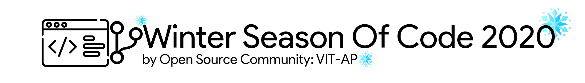

# OSCHub
<!-- ALL-CONTRIBUTORS-BADGE:START - Do not remove or modify this section -->

<!-- ALL-CONTRIBUTORS-BADGE:END -->

    

Project Information
---

A project developed in order to provide a centralized hub for OSC livestreams, as a part of the WSOC Initiative.\
OSCHub is a collaborative project made under the Winter Season of Code Initiative, aiming to work on the issue of manual event tracking, and the redundant utilization of forms for the engagement of the audience.

It strives to provide a simple interface for both the organizers and the attendees of a session, automating the need for filling up a form, and the need for evaluating the responses as well.

A descriptive guide explaining the functioning of the project, has been provided in the [Wiki](https://github.com/Open-Source-Community-VIT-AP/oschub/wiki), created by one of the team members of WSoC2002.

Technical Stack
---

The Technical Stack that has been worked on, throughout the development of this project, is highlighted as below.

| Tech Stack | Components |  |  |  |
|---|---|---|---|---|
| Front End Stack | HTML | CSS | JavaScript | BootStrap |
| Back End Stack | Django | Google Cloud Platform |  |  |
| Hosting / Databases | Google Sheets | PostgreSQL | Heroku |  |

Winter Season of Code Initiative
---

An initiative taken by the Open Source Community, visit the page to learn more.\
[Winter Season of Code](https://wsoc.oscvitap.org)

## Contributors ✨

Thanks goes to these wonderful people ([emoji key](https://allcontributors.org/docs/en/emoji-key)):

<!-- ALL-CONTRIBUTORS-LIST:START - Do not remove or modify this section -->
<!-- prettier-ignore-start -->
<!-- markdownlint-disable -->
<table>
  <tr>
    <td align="center"><a href="http://dat-adi.github.io/tech-portfolio/"> <b>Dat Adithya</b></a> <a href="#design-dat-adi" title="Design">🎨</a> <a href="https://github.com/Open-Source-Community-VIT-AP/oschub/commits?author=dat-adi" title="Documentation">📖</a> <a href="#mentoring-dat-adi" title="Mentoring">🧑‍🏫</a> <a href="#projectManagement-dat-adi" title="Project Management">📆</a></td>
    <td align="center"><a href="https://github.com/kode-logger"> <b>N KRISHNA RAJ</b></a> <a href="https://github.com/Open-Source-Community-VIT-AP/oschub/commits?author=kode-logger" title="Documentation">📖</a> <a href="https://github.com/Open-Source-Community-VIT-AP/oschub/issues?q=author%3Akode-logger" title="Bug reports">🐛</a> <a href="https://github.com/Open-Source-Community-VIT-AP/oschub/commits?author=kode-logger" title="Code">💻</a> <a href="#maintenance-kode-logger" title="Maintenance">🚧</a></td>
  </tr>
</table>

<!-- markdownlint-restore -->
<!-- prettier-ignore-end -->

<!-- ALL-CONTRIBUTORS-LIST:END -->

This project follows the [all-contributors](https://github.com/all-contributors/all-contributors) specification. Contributions of any kind welcome!